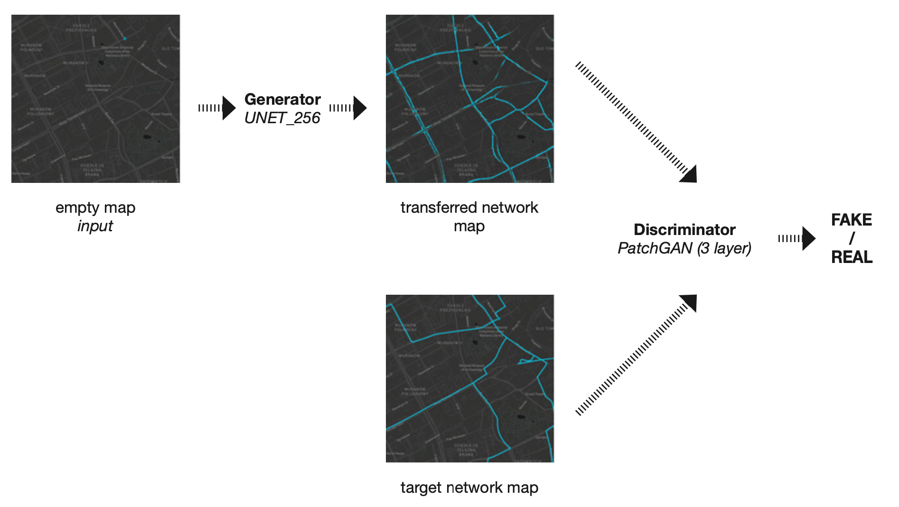
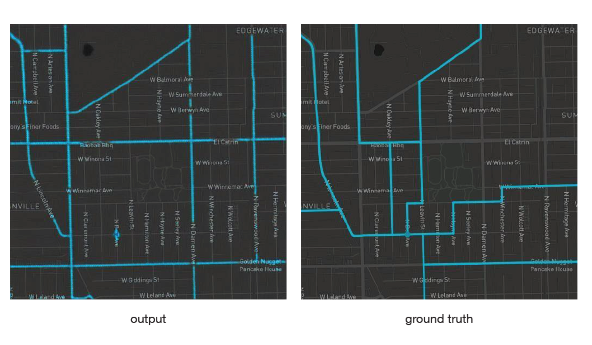

# PixBike

This is the source code & repository for the PixBike project for the course of Algorithmic design of Architectural Informatics at TUM. This project aims to create a [Pix2Pix](https://github.com/junyanz/pytorch-CycleGAN-and-pix2pix) model based on the project of [GrowBike](https://github.com/mszell/bikenwgrowth).
 
**Booklet:** [PixBike Booklet](https://github.com/ozankaraali/pixbike/blob/main/Booklet.pdf)

**Colab:** [PixBike](https://colab.research.google.com/github/ozankaraali/pixbike/blob/main/PixBike.ipynb)

## Workflow (Pix2Pix):

## Sample Result:

## References

- M. Szell, S. Mimar, T. Perlman, G. Ghoshal and R. Sinatra,
„Growing urban bicycle networks“, Scientific Reports, vol. 12,
no. 1, 2022. Available: https://doi.org/10.1038/s41598-022-10783-y [Accessed
31 August 2022].

- P. Isola, J. Zhu, T. Zhou and A. Efros, „Image-to-Image Translation
with Conditional Adversarial Networks“, CVPR, 2017. Available:
https://doi.org/10.48550/arXiv.1611.07004 [Accessed 31 August
2022].
